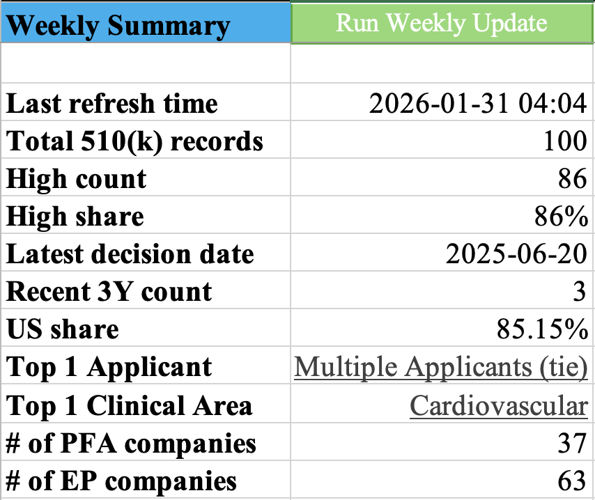
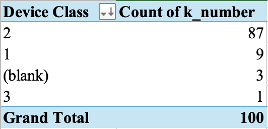
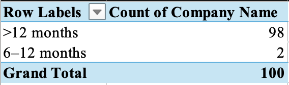

# FDA 510(k) Weekly Tracker — Regulatory Signals → Screening Long-list

## 0) What this is
An internal-style weekly regulatory tracker that converts **FOI classification and FDA 510(k) event data** into:
1) a **one-page Weekly Summary** (weekly KPI snapshot),  
2) a set of **drill-down pivots** (Applicants / Clinical Area / Device Class / Recency), and  
3) a **Companies × Products long-list** used for used for early-stage screening and follow-up review.

**Design intent:** the output reads like a weekly internal update (clear, structured, review-ready), while the build demonstrates practical analyst skills (Power Query, pivots, Excel formulas, basic VBA automation and XLOOKUP).

## 1) Why it matters (business framing)
In healthcare deal screening, “what got cleared, where, and how recently” is often a fast proxy for:
- **Commercial readiness** (recent clearances),
- **Regulatory risk posture** (device class / pathway),
- **Category momentum** (clinical area concentration),
- **Repeat players** (top applicants / product activity).

This tool is built to support internal **weekly monitoring** and **early-stage deal screening**, quickly surfacing “what changed” without manually reworking slides each week.

## 2) What you get (deliverables)
### 2.1 Weekly Summary (1-page)
A compact KPI panel intended for weekly review. Typical items include:
- Total record count
- “High” count/share (rule-based flag)
- Latest decision date + recency indicators
- Top Applicant (tie handled) + Top Clinical Area
- Top Device Class + share
- Long-list recency distribution (activity bucket)

<table align="center">
  <tr>
    <th>Basic Weekly Update</th>
    <th>Intermediate Weekly Update</th>
    <th>Advanced Weekly Update</th>
  </tr>
  <tr>
    <td></td>
    <td></td>
    <td></td>
  </tr>
</table>

### 2.2 Drill-down pivots (for discussion & drill)
- Applicants activity
- Clinical area distribution
- Device class distribution
- Long-list recency buckets

<table align="center">
  <tr>
    <th>Pivot – Top Applicants</th>
    <th>Pivot – Top Applicants (Enriched)</th>
  </tr>
  <tr>
    <td></td>
    <td></td>
  </tr>
</table>

<table align="center">
  <tr>
    <th>Pivot – Clinical Area</th>
    <th>Pivot – Clinical Area (Enriched)</th>
  </tr>
  <tr>
    <td></td>
    <td></td>
  </tr>
</table>

<table align="center">
  <tr>
    <th>Pivot – Top Device Class</th>
    <th>Pivot – Long-list Recency</th>
  </tr>
  <tr>
    <td></td>
    <td></td>
  </tr>
</table>

  <b>Long-list Table</b> 
  

## 3) Data sources used in this build
This repo includes **sample inputs** used to validate the workflow (designed to scale to full history later):
- `original_dataset_2_510k_Top100.json` — 510(k) event records (sample)
- `original_dataset_1_foiclass.txt` — FOI classification reference (Product Code mapping)
- `Medical Device Companies.csv` — an external reference list (used as a lightweight lookup / enrichment input)

> Note: This is an Excel tooling project, not a public data product. Inputs are included only to demonstrate reproducibility of the workflow.

## 4) Core pipeline
### 4.1 Power Query ETL (refreshable)
1) Load raw 510(k) events (100 sample records)
2) Load FOI classification table  
3) **Left join** on `product_code` → `PRODUCTCODE`  
4) Output an enriched event table used by pivots  
   - Query name in workbook: **`Merge(product_code)`**

Why this matters:
- avoids manual copy/paste,
- keeps pivots consistent after refresh,
- separates “source” from “analysis outputs.”

### 4.2 Pivot layer (analysis views)
All pivots point to the **enriched event table** to keep definitions consistent.
- Applicants pivot: counts by `k_number` (or event id)
- Clinical Area pivot: distribution by clinical specialty/area
- Device Class pivot: distribution by FOI device class
- Long-list Recency pivot: company counts by activity bucket

### 4.3 Long-list layer (screening table)
Sheet: `Longlist_Companies_Products`

Purpose: create a stable “company/product pool” that an analyst can annotate and update weekly, fed by regulatory data.
Typical fields:
- Company / Country / Segment / Product Name / Clinical Area  
- Regulatory Path / Latest Milestone  
- Notes (standardized analyst-style phrasing)

Enrichment approach:
- Excel lookup logic (XLOOKUP / structured references) pulls key fields from the event table.
- The structure is designed to switch to **MAX logic** (per company/product) once multi-event history is loaded.

## 5) Automation (one-click weekly refresh)
A simple macro button on `Weekly Summary` triggers a refresh workflow:
- refresh Power Query connections,
- refresh pivot tables,
- update the one-page summary cells.

Goal: reduce the weekly refresh to a repeatable operation (analyst-friendly, low risk of manual errors).

### Refresh Check (Data QC)
Before each weekly output is shared, a simple refresh check is applied:
- FOI classification match rate (join coverage)
- Unmapped FOI count
- PASS / FAIL flag based on a predefined threshold

This ensures the weekly summary and screening long-list are internally reviewable.

## 6) Versioned workbooks (build traceability)
To show how the model evolved, the repo keeps three staged files:
- **Basic**: KPI summary + baseline pivots  
- **Intermediate**: FOI enrichment via `product_code` join + device class pivot  
- **Advanced**: long-list enrichment + recency segmentation + full screenshot pack  

Files:
- `02_PFA_EP_regulatory_tracker_excel_basic...`
- `03_PFA_EP_regulatory_tracker_excel_intermediate...`
- `04_PFA_EP_regulatory_tracker_excel_advanced...`

## 7) Assumptions & limitations
- Current input is a Top-100 sample; scaling to full 510(k) history will:
  - increase repeated applicants/products,
  - make “latest decision date” per company/product meaningful (MAX logic),
  - strengthen trend monitoring across weeks.
- “High / Medium” style flags are rule-based and meant for **screening**, not final diligence conclusions.
- Some fields (e.g., notes/segment) are intentionally semi-manual to reflect analyst workflow.

## 8) Technical & analytical takeaways
- **Power Query**: ETL, type handling, joins, refreshable pipeline  
- **Data modeling in Excel**: structured tables, pivot design, drill-down logic  
- **Business-ready reporting**: KPI summary layout, tie-handling, recency segmentation  
- **Automation**: simple VBA macro to make the weekly workflow repeatable  
- **Communication**: turning raw regulatory events into a screening view + weekly narrative-ready outputs

