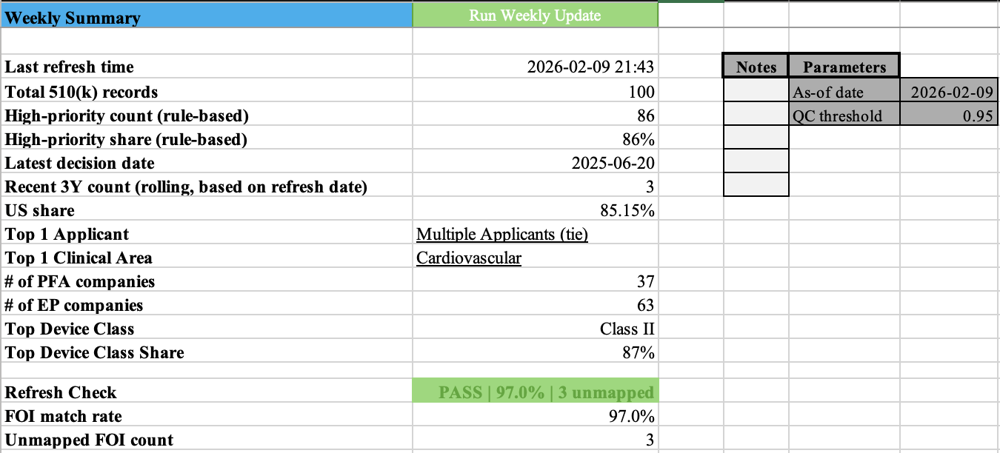

# FDA 510(k) Weekly Tracker — Regulatory Signals → Screening Long-list

## 0) What this is
An internal-style weekly regulatory tracker that converts **FDA 510(k) event data + FOI classification mapping** into:
1) a **one-page Weekly Summary** (KPI snapshot + QA gate),
2) a set of **drill-down pivots** (Applicants / Clinical Area / Device Class / Recency), and
3) a **Companies × Products long-list** for early-stage screening and follow-up review.

**Design intent:** the output reads like a weekly internal update (clean, review-ready, drillable).
The build is refreshable and analyst-friendly (Power Query, pivots, Excel formulas, VBA automation, and **XLOOKUP-driven drill-down hyperlinks**).

## 1) Why it matters (business framing)
In healthcare deal screening, “what got cleared, where, and how recently” is often a fast proxy for:
- **Commercial readiness** (recent clearances),
- **Regulatory risk posture** (device class / pathway),
- **Category momentum** (clinical area concentration),
- **Repeat players** (top applicants / product activity).

This tool is built to support internal **weekly monitoring** and **early-stage deal screening**, quickly surfacing “what changed” without manually reworking slides each week.

## 2) What you get (deliverables)
### 2.1 Weekly Summary (1-page)
Across versions, the one-page Weekly Summary keeps the same layout, while functionality is added step-by-step:

- **Basic (v1)**: establishes the core KPI snapshot for a weekly internal check-in
  (refresh timestamp, total records, rule-based high count/share, latest decision date, rolling activity, US share, top applicant / top clinical area, and focus-company counts for PFA/EP).
  
- **Intermediate (v2)**: keeps the same weekly page, but strengthens the regulatory interpretation layer by adding **FOI enrichment**
  (product_code → PRODUCTCODE), enabling **device class reporting** on the summary (Top Device Class + share).
  
- **Advanced (v3)**: upgrades the weekly page into a review-ready dashboard by adding lightweight governance and drillability:
  - **Top drivers become dynamic**: Top 1 Applicant / Top 1 Clinical Area can be pulled from the **enriched pivots** via **XLOOKUP**
    (tie handled) and displayed as **clickable drill-down hyperlinks**
  - **Refresh Check (Data QC gate)**: FOI match rate, unmapped FOI count, and a **PASS/FAIL** flag
  - **Parameters**: As-of date (reporting cut) and QC threshold (drives PASS/FAIL) to avoid hard-coding and keep outputs review-ready
  - A small **Notes** area reserved for weekly call comments / follow-ups

**Core KPIs are visible in the screenshots below.**

<table align="center">
  <tr>
    <th>Basic Weekly Update</th>
    <th>Intermediate Weekly Update</th>
  </tr>
  <tr>
    <td></td>
    <td></td>
  </tr>

  <tr><td colspan="2" height="25"></td></tr>

  <tr>
    <th colspan="2">Advanced Weekly Dashboard</th>
  </tr>
  <tr>
    <td colspan="2" align="center">
      
    </td>
  </tr>
</table>

### 2.2 Drill-down pivots (for discussion & drill)
- Applicants activity
- Clinical area distribution
- Device class distribution
- Long-list recency buckets

<table align="center">
  <tr>
    <th>Pivot – Top Applicants</th>
    <th>Pivot – Top Applicants (Enriched)</th>
  </tr>
  <tr>
    <td></td>
    <td></td>
  </tr>
</table>

<table align="center">
  <tr>
    <th>Pivot – Clinical Area</th>
    <th>Pivot – Clinical Area (Enriched)</th>
  </tr>
  <tr>
    <td></td>
    <td></td>
  </tr>
</table>

<table align="center">
  <tr>
    <th>Pivot – Top Device Class</th>
    <th>Pivot – Long-list Recency</th>
  </tr>
  <tr>
    <td></td>
    <td></td>
  </tr>
</table>

  <b>Long-list Table</b> 
  

## 3) Data sources used in this build
This repo includes **sample inputs** used to validate the workflow (designed to scale to full history later):
- `original_dataset_2_510k_Top100.json` — 510(k) event records (sample)
- `original_dataset_1_foiclass.txt` — FOI classification reference (Product Code mapping)
- `Medical Device Companies.csv` — an external reference list (used as a lightweight lookup / enrichment input)

> Note: This is an Excel tooling project, not a public data product. Inputs are included only to demonstrate reproducibility of the workflow.

## 4) Core pipeline
### 4.1 Power Query ETL (refreshable)
1) Load raw 510(k) events (100 sample records)
2) Load FOI classification table  
3) **Left join** on `product_code` → `PRODUCTCODE`  
4) Output an enriched event table used by pivots  
   - Query name in workbook: **`Merge(product_code)`**

Why this matters:
- avoids manual copy/paste,
- keeps pivots consistent after refresh,
- separates “source” from “analysis outputs.”

### 4.2 Pivot layer (analysis views)
All pivots point to the **enriched event table** to keep definitions consistent.
- Applicants pivot: counts by `k_number` (or event id)
- Clinical Area pivot: distribution by clinical specialty/area
- Device Class pivot: distribution by FOI device class
- Long-list Recency pivot: company counts by activity bucket

## 4.3 Long-list layer (screening table)
Sheet: `Longlist_Companies_Products`

**Purpose**
- Create a working pool (company / product) that an analyst can annotate during screening and follow-up.

**Build**
- Seeded from the master 510(k) table (structured references).
- Sample input is Top-100, so repeats may show up.
- Key signals: Latest 510(k) Decision Date (MAXIFS) + recency bucket.

**Use**
- Add analyst notes / priority tags during initial review.
- Drill down via enriched pivots when needed.

**Next (when scaled)**
- Move to a one-line-per-company/product view with “latest milestone” logic.

## 5) Automation (one-click weekly refresh)
A macro button on `Weekly_Update` triggers:
- refresh Power Query connections + pivots,
- update the “Last refresh time” timestamp.

Goal: reduce the weekly refresh to a repeatable operation (analyst-friendly, low risk of manual errors).

### Refresh Check (Data QC gate)
Before sharing the weekly output, the dashboard displays:
- FOI match rate (join coverage),
- unmapped FOI count,
- PASS/FAIL based on a configurable QC threshold.

This ensures the weekly summary and screening long-list are internally reviewable.

## 6) Versioned workbooks (build traceability)
To show how the model evolved, the repo keeps three staged files:
- **Basic**: KPI summary + baseline pivots  
- **Intermediate**: FOI enrichment via `product_code` join + device class pivot  
- **Advanced**: long-list enrichment + recency segmentation + full screenshot pack  

Files:
- `02_PFA_EP_regulatory_tracker_excel_basic...`
- `03_PFA_EP_regulatory_tracker_excel_intermediate...`
- `04_PFA_EP_regulatory_tracker_excel_advanced...`

## 7) Assumptions & limitations
- Current input is a Top-100 sample; scaling to full 510(k) history will:
  - increase repeated applicants/products,
  - make “latest decision date” per company/product meaningful (MAX logic),
  - strengthen trend monitoring across weeks.
- “High / Medium” style flags are rule-based and meant for **screening**, not final diligence conclusions.
- Some fields (e.g., notes/segment) are intentionally semi-manual to reflect analyst workflow.

## 8) Technical & analytical takeaways
- **Power Query**: ETL, type handling, joins, refreshable pipeline  
- **Data modeling in Excel**: structured tables, pivot design, drill-down logic  
- **Business-ready reporting**: KPI summary layout, tie-handling, recency segmentation  
- **Automation**: simple VBA macro to make the weekly workflow repeatable  
- **Communication**: turning raw regulatory events into a screening view + weekly narrative-ready outputs

