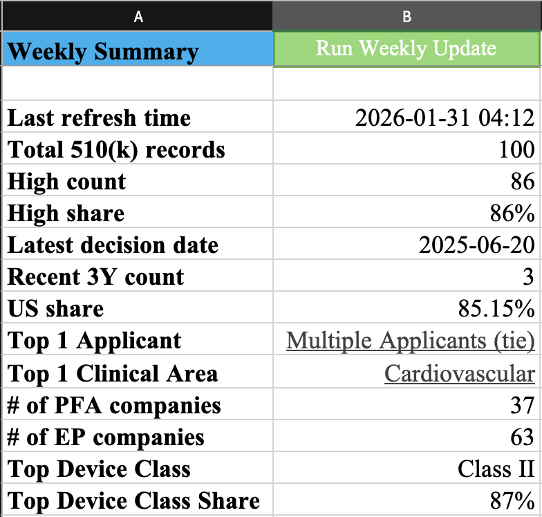

# FDA 510(k) Weekly Tracker — Regulatory Signals → Screening Long-list

## 0) What this is
A lightweight Excel-based workflow that turns **foiclass and FDA 510(k) event data** into:
1) a **one-page Weekly Summary** (weekly KPI snapshot),  
2) a set of **drill-down pivots** (Applicants / Clinical Area / Device Class / Recency), and  
3) a **Companies × Products long-list** used for early-stage screening and follow-up diligence.

**Design intent:** the output reads like a weekly internal update (clear, structured, review-ready), while the build demonstrates practical analyst skills (Power Query, pivots, Excel formulas, basic VBA automation and XLOOKUP).

## 1) Why it matters (business framing)
In healthcare deal screening, “what got cleared, where, and how recently” is often a fast proxy for:
- **Commercial readiness** (recent clearances),
- **Regulatory risk posture** (device class / pathway),
- **Category momentum** (clinical area concentration),
- **Repeat players** (top applicants / product activity).

This tool is built to support **weekly monitoring** and quickly surface “what changed” without manually reworking slides each week.

## 2) What you get (deliverables)
### 2.1 Weekly Summary (1-page)
A compact KPI panel intended for weekly review. Typical items include:
- Total record count
- “High” count/share (rule-based flag)
- Latest decision date + recency indicators
- Top Applicant (tie handled) + Top Clinical Area
- Top Device Class + share
- Long-list recency distribution (activity bucket)

<figure style="display:inline-block; text-align:center; margin:10px">
  
  <figcaption><b>Basic Weekly Update</b></figcaption>
</figure>

<figure style="display:inline-block; text-align:center; margin:10px">
  
  <figcaption><b>Intermediate Weekly Update</b></figcaption>
</figure>

<figure style="display:inline-block; text-align:center; margin:10px">
  
  <figcaption><b>Advanced Weekly Update</b></figcaption>
</figure>
